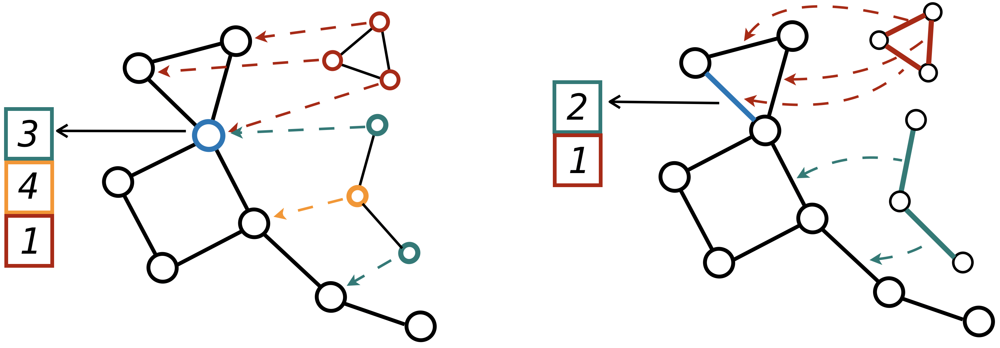

# Improving Graph Neural Network Expressivity via Subgraph Isomorphism Counting

Official PyTorch implementation of the paper

**Improving Graph Neural Network Expressivity via Subgraph Isomorphism Counting**
Giorgos Bouritsas, Fabrizio Frasca, Stefanos Zafeiriou, Michael M. Bronstein
[arxiv_link](https://arxiv.org/abs/2006.09252)

tl;dr: We provably improve GNN expressivity by enhancing message passing with substructure encodings. Our method allows incorporating domain specific prior knowledge and can be used as a drop-in replacement of traditional GNN layers in order to boost their performance in a variety of applications (molecules, social networks, etc.)



**Abstract**: While Graph Neural Networks (GNNs) have achieved remarkable results in a
variety of applications, recent studies exposed important shortcomings in their
ability to capture the structure of the underlying graph. It has been shown that
the expressive power of standard GNNs is bounded by the Weisfeiler-Lehman
(WL) graph isomorphism test, from which they inherit proven limitations such
as the inability to detect and count graph substructures. On the other hand, there
is significant empirical evidence, e.g. in network science and bioinformatics,
that substructures are often informative for downstream tasks, suggesting that
it is desirable to design GNNs capable of leveraging this important source of
information. To this end, we propose a novel topologically-aware message passing
scheme based on substructure encoding. We show that our architecture allows
incorporating domain-specific inductive biases and that it is strictly more expressive
than the WL test. Importantly, in contrast to recent works on the expressivity
of GNNs, we do not attempt to adhere to the WL hierarchy; this allows us to
retain multiple attractive properties of standard GNNs such as locality and linear
network complexity, while being able to disambiguate even hard instances of graph
isomorphism. We extensively evaluate our method on graph classification and
regression tasks and show state-of-the-art results on multiple datasets including
molecular graphs and social networks.

## Dependencies and Installation Instructions

Requirements:
- python 3.7
- pytorch>=1.4.0
- cudatoolkit>=10.1
- pytorch geometric>=1.4.3 (data preprocessing and data loaders)
- graph-tool (subgraph isomorphism)
- tqdm
- ogb (experiments on the ogb datasets)
- wandb (optional: experiment monitoring)
- tensorboardX (experiment monitoring, alternative to wandb)

Recommended setup installations
```
conda create --name gsn python=3.7
conda activate gsn
conda install pytorch==1.4.0 cudatoolkit=10.1 -c pytorch
pip install torch-scatter==latest+cu101 -f https://pytorch-geometric.com/whl/torch-1.4.0.html
pip install torch-sparse==latest+cu101 -f https://pytorch-geometric.com/whl/torch-1.4.0.html
pip install torch-cluster==latest+cu101 -f https://pytorch-geometric.com/whl/torch-1.4.0.html
pip install torch-geometric
conda install -c conda-forge graph-tool
pip install ogb
pip install tqdm
pip install wandb
pip install tensorboardX

```
## Datasets - Usage Examples

### Strongly Regular graphs

We provide an exemplary family of Strongly Regular graphs, i.e. SR(25,12,5,6). By running the command below you can run an isomorphism test with GSN (untrained network) that will try to distinguish all available pairs from the family. Other substructure configurations can be tested, e.g. by setting --id_type to path_graph, complete_graph, etc., --induced to True or False (graphlets vs. motifs), --k to any positive integer number to define the size of the largest substructure, --id_scope to local or global (GSN-e vs GSN-v).

The expected results from the following command is 0% failure.
```Cycle GSN-e (6-length graphlet cycles)
python graph_classification.py --seed 0 --onesplit True --dataset SR_graphs --dataset_name sr251256 --root_folder ./datasets --id_type cycle_graph --induced True --k 6 --id_scope local --id_embedding one_hot_encoder --model_name GSN_sparse --num_layers 2 --d_out 64 --msg_kind general --bn False --readout sum --final_projection False --jk_mlp True --mode untrained --device_idx 9 --wandb False
```

To test a traditional GNN (expected result: 100% failure), run the following command:
```traditional GNN (equiv. to 1-WL)
python graph_classification.py --seed 0 --onesplit True --dataset SR_graphs --dataset_name sr251256 --root_folder ./datasets --id_type cycle_graph --induced True --k 6 --id_scope local --id_embedding one_hot_encoder --model_name MPNN_sparse --num_layers 2 --d_out 64 --msg_kind general --bn False --readout sum --final_projection False --jk_mlp True --mode untrained --device_idx 0 --wandb False
```

### TUD Datasets

We provide the raw data, split indices (obtained from https://github.com/weihua916/powerful-gnns) and preprocessed data for one dataset (IMDBBINARY). We provide the command that performs the evaluation procedure mentioned in the supplementary material (cross-validation), with the best performing hyperparameters.

```
python graph_classification.py --seed 0 --onesplit False --dataset social --dataset_name IMDBBINARY --root_folder ./datasets --id_type complete_graph --induced False --k 5 --id_scope local --degree_as_tag False --lr 1e-3 --dropout_features 0 --decay_steps 10 --decay_rate 0.5 --batch_size 32 --id_encoding one_hot_unique --id_embedding one_hot_encoder --model_name GSN_sparse --num_layers 4 --d_out 64 --msg_kind gin --readout mean --final_projection True --jk_mlp False --num_iters 50 --mode train --device_idx 0 --wandb False
```

### ZINC

For the ZINC dataset, the raw data can be obtained from https://github.com/graphdeeplearning/benchmarking-gnns by running the following commands in the ./datasets/chemical/ZINC/ folder:
```
curl https://www.dropbox.com/s/feo9qle74kg48gy/molecules.zip?dl=1 -o molecules.zip -J -L -k
unzip molecules.zip -d ./
```
We provide the split indices (obtained from the same repository). Preprocessed data will be computed before starting the training by running the following command:
```
python graph_classification.py --seed 0 --onesplit True --dataset chemical --dataset_name ZINC --root_folder ./datasets --id_type cycle_graph --induced False --k 8 --id_scope global --degree_as_tag False --lr 1e-3 --dropout_features 0 --scheduler ReduceLROnPlateau --decay_rate 0.5 --patience 5 --min_lr 1e-5 --batch_size 128 --id_encoding one_hot_unique --id_embedding one_hot_encoder --input_node_encoder one_hot_encoder --edge_encoder one_hot_encoder --model_name GSN_edge_sparse --num_layers 4 --d_out 128 --msg_kind general --readout sum --final_projection False --jk_mlp True --mode train --regression True --loss_fn L1Loss --prediction_fn L1Loss --device_idx 8 --wandb False
```

This will train and evaluate our best GSN^E model (i.e. general MPNN formulation with edge features and structural identifiers) as described in the supplementary material (result reported in Table 2 of the main paper). In order to obtain the mean and standard deviation reported in the paper, you will need to run the above command 10 times by changing the seed to 1,2,...,9.

# OGBG MOL-HIV

For the MOL-HIV dataset, the raw data will be downloaded automatically before starting the training. We provide the split indices (obtained from the authors of OGB https://ogb.stanford.edu/). Preprocessed data will be computed before starting the training by running the following command:
```
 python graph_classification.py --seed 0 --onesplit True --dataset ogb --dataset_name ogbg-molhiv --root_folder ./datasets --id_encoding one_hot_unique --id_type cycle_graph --induced True --k 6 --id_scope local --degree_as_tag False --lr 1e-3 --dropout_features 0.5 --scheduler None --batch_size 32 --id_embedding embedding --input_node_encoder atom_encoder --edge_encoder bond_encoder --model_name GSN_edge_sparse_ogb --num_layers 5 --d_out 300 --d_h 600 --msg_kind ogb --readout mean --final_projection False --jk_mlp False --mode train --features_scope full --vn True --input_vn_encoder embedding --loss_fn BCEWithLogitsLoss --prediction_fn multi_class_accuracy --device_idx 7 --wandb False
```

This will train and evaluate our best GSN-VN-AF model (i.e. virtual node & additional features) as described in the supplementary material (results reported in Table 3 of the main paper). In order to obtain the mean and standard deviation reported in the paper, you will need to run the above command 10 times by changing the seed to 1,2,...,9.


## Results

By following the instructions above to train our models on each of the datasets, the following results are expected:

+----------------------------------------------------------+
|   Dataset      |      Performance                        |
| ---------------|---------------------------------------  |
|  SR(25,12,5,6) |     0%              Failure Percentage  |
|  IMDBBINARY    |     77.8% ± 3.3%    Accuracy            |
|  ZINC          |     0.108 ± 018     Mean Absolute Error |
|  MOL-HIV       |     77.99% ± 1.00%  ROC-AUC             |
+----------------------------------------------------------+

The rest of the results reported in the main paper can be obtained accordingly, i.e. by changing the hyperparameters as per the supplementary material.
